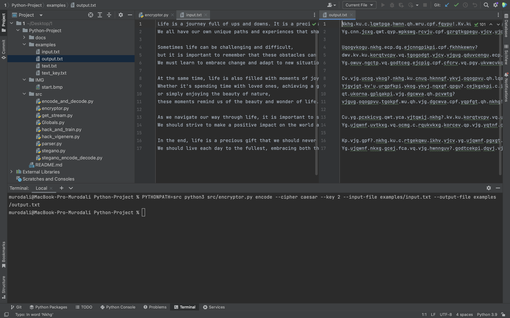
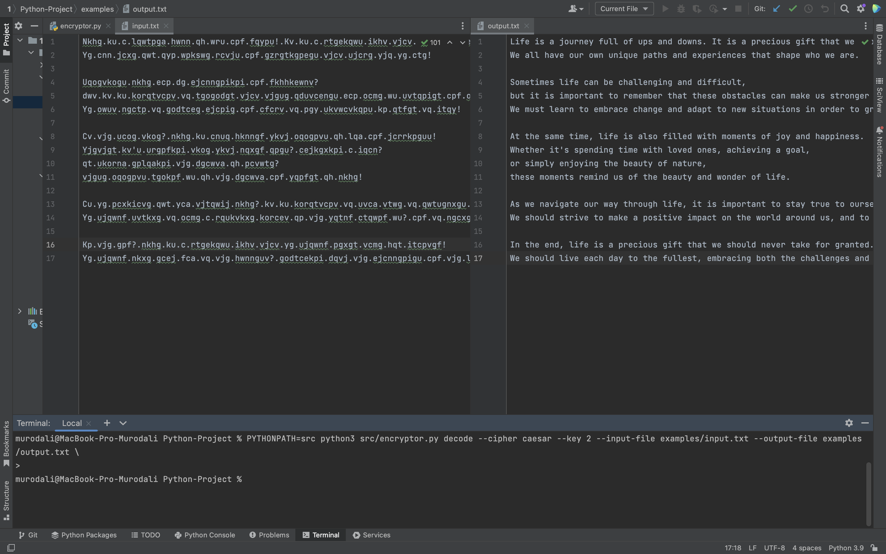
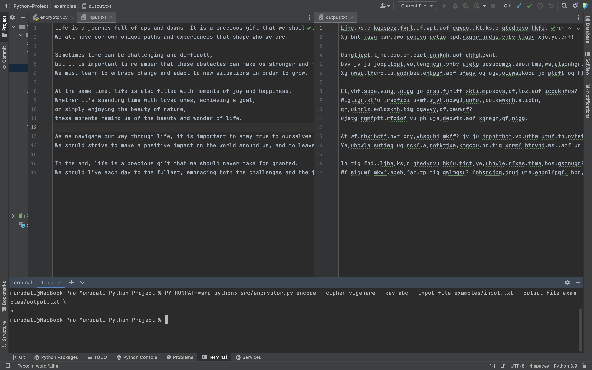
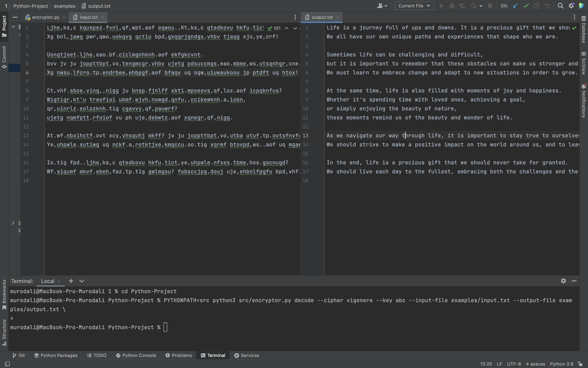
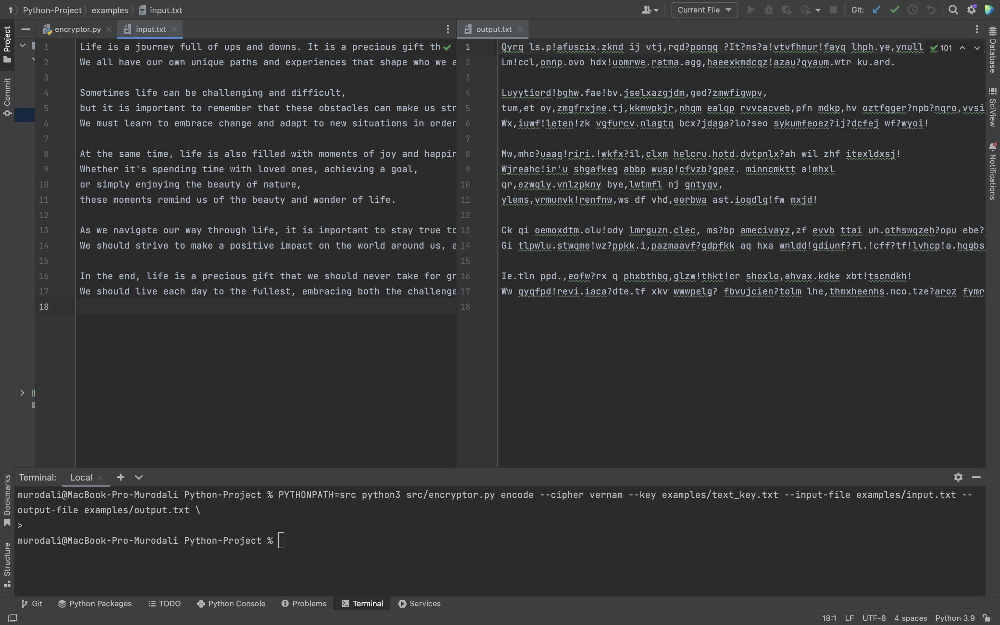
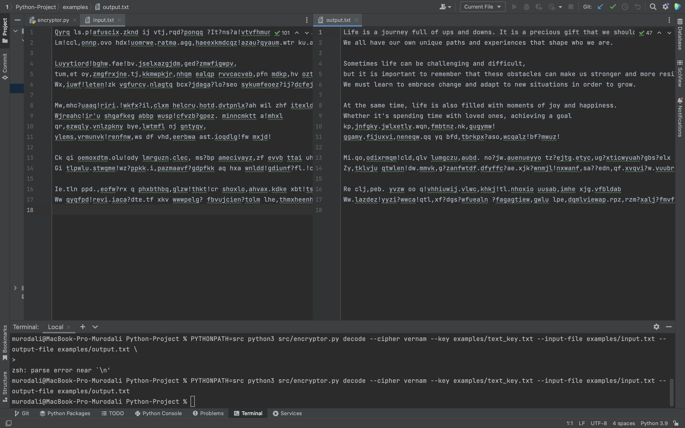
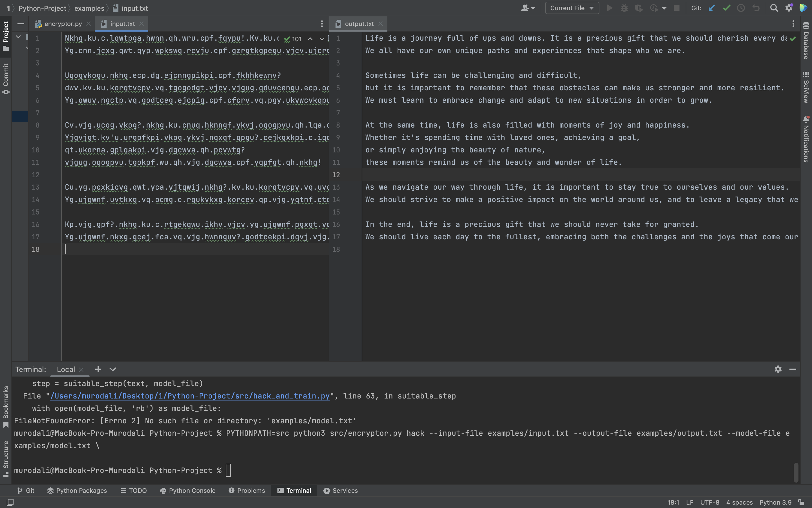

# Проект КТ 
### Клонирование репозитория с помощью ssh
В терминале запускайте следующую команду
> git clone https://github.com/AMaftuna/Python-Project.git

можно заметить, что появилась папка Python-Project, наберите эти команды
> cd Python-Project\
дальнейшие работы также делайте в том же терминале для каждого случая(ниже приведены примеры и скрины для них)

### Шифрование шифра Цезаря:
За шифрование шифра Цезаря отвечает "encryptor.py"
Как запустить ? 
>  PYTHONPATH=src python3 src/encryptor.py encode --cipher caesar --key 2 --input-file examples/input.txt --output-file examples/output.txt \
> \
Зашифровать входное сообщение с помощью ключа

### Дешифрование шифра Цезаря:
За дешифрование шифра Цезаря отвечает encryptor.py
Как запустить ?
>  PYTHONPATH=src python3 src/encryptor.py decode --cipher caesar --key 2 --input-file examples/input.txt --output-file examples/output.txt \
> \
Расшифровать входное сообщение, зная ключ, с которым оно было зашифровано

### Шифрование шифра Виженера:
За шифрование шифра Виженера отвечает encryptor.py
Как запустить ?
>  PYTHONPATH=src python3 src/encryptor.py encode --cipher vigenere --key abc --input-file examples/input.txt --output-file examples/output.txt \
> \
Зашифровать входное сообщение с помощью ключа

### Дешифрование шифра Виженера:
За дешифрование шифра Виженера отвечает encryptor.py
Как запустить ?
>  PYTHONPATH=src python3 src/encryptor.py decode --cipher vigenere --key abc --input-file examples/input.txt --output-file examples/output.txt \
> \
Расшифровать входное сообщение, зная ключ, с которым оно было зашифровано

### Шифрование шифра Вернама:
За шифрование шифра Вернама отвечает encryptor.py
Как запустить ?
>  PYTHONPATH=src python3 src/encryptor.py encode --cipher vernam --key examples/text_key.txt --input-file examples/input.txt --output-file examples/output.txt \
> \
Зашифровать входное сообщение с помощью ключа

### Дешифрование шифра Вернама:
За дешифрование шифра вернама отвечает encryptor.py
Как запустить ?
>  PYTHONPATH=src python3 src/encryptor.py decode --cipher vernam --key examples/text_key.txt --input-file examples/input.txt --output-file examples/output.txt \
> \
Расшифровать входное сообщение, зная ключ, с которым оно было зашифровано

### Построить языковую модель для взлома:

> PYTHONPATH=src python3 src/encryptor.py train  --text-file examples/text.txt --model-file examples/model.txt \
> \
> Проанализировать большой текст(текст Шекспира) и построить языковую модель

### Взлом шифра Цезаря методами частотного анализа:

> PYTHONPATH=src python3 src/encryptor.py hack --input-file examples/input.txt --output-file examples/output.txt --model-file examples/model.txt \
> \
> Рассшифровать текст

### Взлом шифра Виженера с помощью индексов совпадений:
> PYTHONPATH=src python3 src/encryptor.py hack_vigenere --input-file examples/input.txt --output-file examples/output.txt] --model-file examples/model.txt \
> \
> Рассшифровать текст

### Стеганография:
> PYTHONPATH=src python3 src/stegano.py stegano_encode  --start-img start.bmp --encoded-img encoded.bmp --input-file examples/input.txt \
> \
Шифрование

Можно заметить, что фотографии практически ничем не отличаются 

> PYTHONPATH=src python3 src/stegano.py stegano_encode --encoded-img encoded.bmp --output-file examples/output.txt \
> \
Расшифрование
